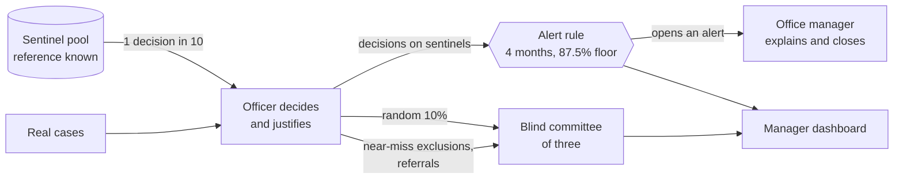
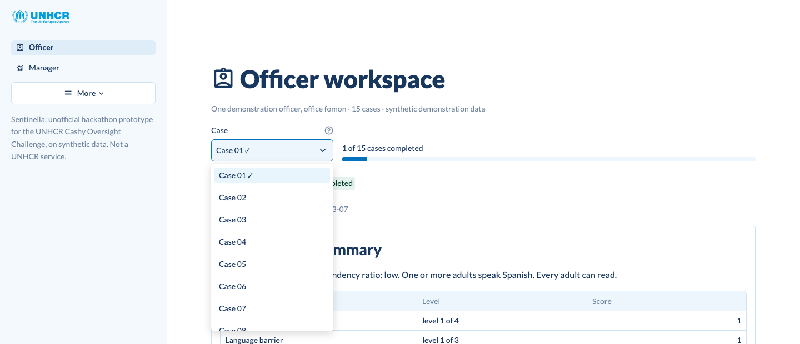
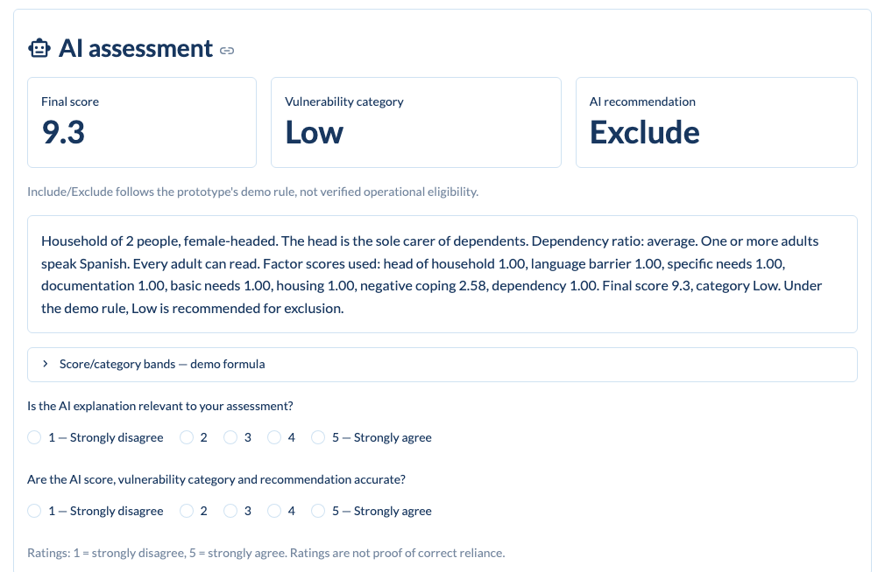
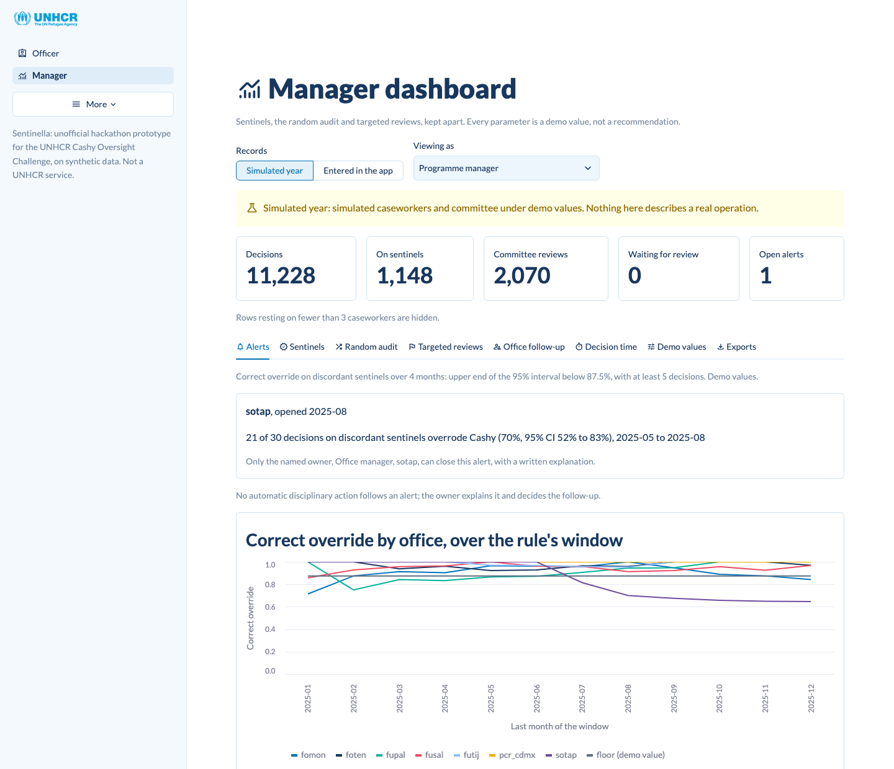

<p align="center">
  
</p>

<h1 align="center">Sentinella</h1>

<p align="center">
  <strong>Human oversight of AI-assisted cash targeting, one case at a time.</strong><br>
  Our entry to the Cashy Oversight Challenge at the
  <a href="https://sites.google.com/unitn.it/datainnovationforrefugee/home-page">Data &amp; Innovation for Refugee Inclusion Hackathon</a>,
  University of Trento and UNHCR Innovation, Trento, October 2026.
</p>

<p align="center">
  
  
  
  
</p>

> [!IMPORTANT]
> Prototype built at a University of Trento hackathon supported by UNHCR, on synthetic
> data. It is not an operational service.

## 🎯 The problem

UNHCR targets cash assistance to displaced households with an expert-designed Scorecard.
Cashy, an AI prototype, predicts the Scorecard result and recommends include or exclude; a
caseworker makes the decision. That oversight works only while caseworkers keep correcting
Cashy when it is wrong. In an earlier experiment with 31 caseworkers, those who saw
Responsible-AI statements on the decision screen overrode Cashy's wrong recommendations on
66.7% of assessments, against 96.2% for those who did not
([challenge brief, Annex II](docs/challenge_website.md)).

Sentinella measures that oversight continuously, so that an operation can see when
caseworkers stop catching errors, and in which office.

## 🧭 How it measures oversight

Three measurement streams are kept apart, in the records and in every estimate. The rates and
thresholds below are demo values from [config/demo.toml](config/demo.toml).

| Stream | How decisions are chosen | What it tells the manager |
| :--- | :--- | :--- |
| Sentinels | 1 decision in 10 is on a household kept out of the real queue, whose reference decision is known in advance. Half show a deliberately wrong Cashy answer: a misread input, a category that does not match the score, or reasoning that does not match the answer | Correct override, over-reliance, correct acceptance and under-reliance, every month |
| Random audit | A random 10% of real decisions, accepted and overridden alike, goes to a committee of three that sees the household record only | How often decisions disagree with the committee. A disagreement is not an established error |
| Targeted reviews | Exclusions one factor level away from inclusion, and any decision a manager refers with a written reason | Individual cases to correct. They are chosen for risk, so they never enter a rate |

An alert opens for an office when its correct override on discordant sentinels over the last
four months has the upper end of its 95% interval below 87.5%, with at least five such
decisions. Only the office manager can close it, and only with a written explanation. No
automatic sanction follows.



Every role, what it sees and what it cannot do are set out in
[organizational_framework.md](organizational_framework.md).

## 🖥️ The prototype

A Streamlit app with two workspaces, linked from the sidebar. The start page, the committee
review and the About page sit under **More**.

### Officer workspace

One demonstration officer works through 15 cases, picked from a dropdown by case number. A
check mark shows the cases whose final decision is recorded.

<p align="center">
  
</p>

For each case the officer reads a household summary and the available record, checks the
factors whose one-level change would change the category, and opens the AI assessment when
ready: score, vulnerability category, recommendation and reasoning. The officer rates the
explanation and the answer separately, then records Include or Exclude with a justification
written so that it could be shared with the household.

<p align="center">
  
</p>

- **Case 02** is a sentinel with a deliberately wrong AI answer. The officer learns its
  reference decision after submitting.
- **Case 03** is human first: the officer saves an initial decision and justification before
  the AI assessment becomes available, then records the final decision separately.

### Manager dashboard

<p align="center">
  
</p>

The dashboard shows either a simulated year of seven offices or the decisions entered in the
app, never pooled. Its tabs hold the alert queue and the rule's chart, sentinel and
random-audit rates with 95% intervals, targeted-review counts, recorded decision time, the
demo values and CSV exports for Power BI or any BI tool. Viewing as an office manager adds
that office's follow-up: targeted reviews the committee decided otherwise, each caseworker
compared with the committee, human-first cases before and after the AI assessment and, for
decisions entered in the app, referral for blind review. Figures resting on fewer than three
caseworkers are hidden.

The committee review shows each selected decision's household record alone, without Cashy's
answer, the officer's decision or the reason the case was selected. Three members vote and
the majority decides.

## 🚀 Quick start

Python 3.12. From the repository root:

```sh
# macOS and Linux
python3.12 -m venv .venv
.venv/bin/python -m pip install -r requirements.txt
.venv/bin/python -m streamlit run app/streamlit_app.py
```

```powershell
# Windows (PowerShell)
py -3.12 -m venv .venv
.venv\Scripts\python.exe -m pip install -r requirements.txt
.venv\Scripts\python.exe -m streamlit run app/streamlit_app.py
```

The app opens at http://localhost:8501. It needs the S8 synthetic sample, saved unchanged as
`data/S8.synthetic_cashy_sample.csv`; [data/README.md](data/README.md) says where to get it
and how to check it. The simulated year is generated from the dashboard with one click.

The same steps from the command line, plus the detection study and the exports (on Windows,
replace `.venv/bin/python` with `.venv\Scripts\python.exe`):

```sh
# A simulated year of seven offices, in a few seconds
.venv/bin/python -m src.sentinella.simulate history

# The alert rule over 200 simulated years per scenario, about 5 minutes
.venv/bin/python -m src.sentinella.simulate detection

# CSV tables with schema.csv, written to data/exports/<source>/
.venv/bin/python -m src.sentinella.export simulation
.venv/bin/python -m src.sentinella.export app
```

## 📊 Results on synthetic data

> [!NOTE]
> These numbers describe the synthetic sample and a simulation under demo values, not a real
> operation.

- **Alert rule.** In the simulation, correct override in one office falls from 96.2% to 66.7%
  in month 7, the two arms of the brief's experiment. The rule caught the fall in 181 of 200
  simulated years (90.5%, 95% CI 85.6% to 93.8%), a median of 2 months after the change and
  within 3 months in 80.5% of them. In the control scenario, 5 of 200 simulated years raised a
  false alarm (2.5%, 95% CI 1.1% to 5.7%). Source: `python -m src.sentinella.simulate detection`.
- **Scorecard formula.** The formula recovered from the sample reproduces the final score of
  every held-out household to within 0.00002 points with no fitted parameters, and the
  recorded category of 1,890 of the 1,900 households
  ([report 01](reports/01_data_exploration.md), [report 02](reports/02_score_model.md)). The
  prototype's AI assessment uses this formula.

## 🔬 Data science

| Notebook | Report | What it does |
| :--- | :--- | :--- |
| [01_data_exploration.ipynb](notebooks/01_data_exploration.ipynb) | [01_data_exploration.md](reports/01_data_exploration.md) | Checks S8 against its data dictionary and recovers the Scorecard formula |
| [02_score_model.ipynb](notebooks/02_score_model.ipynb) | [02_score_model.md](reports/02_score_model.md) | Tests the formula against learned models on held-out data and builds per-factor explanations |

The [model card](reports/model_card.md) states what the score model can and cannot be used
for. The notebooks run top to bottom on a fresh kernel and need extra packages:

```sh
.venv/bin/python -m pip install -r requirements-analysis.txt
.venv/bin/jupyter nbconvert --to notebook --execute --inplace notebooks/01_data_exploration.ipynb
.venv/bin/jupyter nbconvert --to notebook --execute --inplace notebooks/02_score_model.ipynb
```

On macOS, LightGBM also needs the OpenMP runtime: `brew install libomp`.

## 🗂️ Repository layout

```
app/                         Streamlit pages; UNHCR logo files in assets/
config/                      demo.toml: every parameter of the prototype, with its reason
data/                        S8 sample and local databases (not tracked), with a README
docs/                        Challenge brief; images/ holds the logos and screenshots
notebooks/                   Analyses, numbered in the order they run
reports/                     Phase reports and model card, with figures/ and tables/
src/                         Scorecard formula, data dictionary and analysis code
src/sentinella/              Sentinels, audit, alerts, metrics, simulation and exports
tests/                       Unit and app tests
wiki/                        Team knowledge base: challenge, sources and design decisions
organizational_framework.md  Who decides, who checks and who answers for an alert
```

## 🧪 Tests and checks

```sh
.venv/bin/python -m pip install -r requirements-dev.txt
.venv/bin/python -m pytest
.venv/bin/ruff check .
.venv/bin/ruff format --check .
```

Tests that need the S8 file skip when it is absent; provide it to run the whole suite. The app
tests run the pages headless on temporary databases and never touch `data/*.sqlite`.

## ⚖️ Limits

- Every household is synthetic and every parameter a demo value. Nothing here describes the
  real operation.
- "Correct" means agreement with a reference decision or with the committee, the institution's
  standard, not the truth about a household's need. A sentinel's reference is the demo rule
  applied to the formula category of its record.
- Sentinels measure how caseworkers treat cases built to test them; the random audit checks
  whether real cases get the same treatment.
- Include and Exclude follow a demo rule (High and Severe included), not operational
  eligibility, which also depends on funding and administrative checks. Eligibility is never
  benchmarked, and no result is compared with the 67.6% accuracy reported for Cashy on real
  data.
- Recorded time includes interruptions and is not a measure of attention. Ratings are not proof
  of correct reliance.
- Role navigation is not authentication. The available record is not the complete operational
  questionnaire, and the factors to verify are local sensitivity aids, not a validated
  checklist.
- No attempt is made to re-identify, link or reconstruct households, caseworkers or offices.
- The project does not show that these workflows improve reliance or sustain attention; that
  needs an independent evaluation.

---

<p align="center">
  <br>
  <sub>Prototype for the Cashy Oversight Challenge, built at the
  <a href="https://sites.google.com/unitn.it/datainnovationforrefugee/home-page">Data &amp; Innovation for Refugee Inclusion Hackathon</a>
  of the University of Trento, supported by UNHCR Innovation, on synthetic data.
  Logo files from Wikimedia Commons, unmodified.</sub>
</p>
