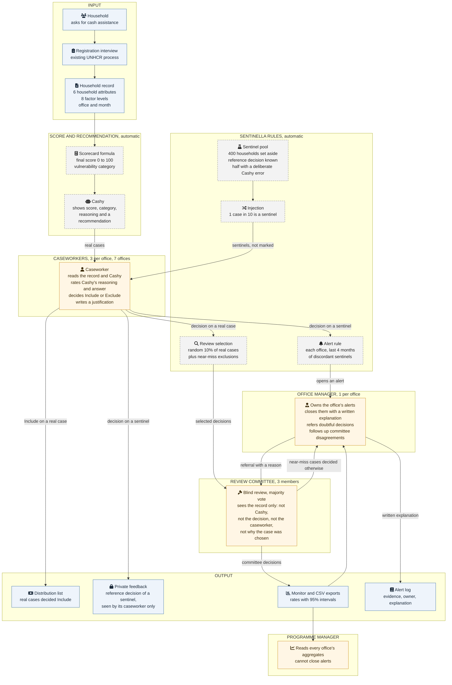
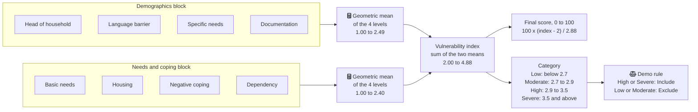

# Sentinella as an organization

How a household's request moves through the oversight framework: who decides,
who checks, who answers for an alert, and what each step produces. Code is not
described here; the [README](README.md) covers it.

Every number below is a demo value from [config/demo.toml](config/demo.toml),
chosen to run the prototype on the S8 synthetic sample, not a recommendation for
a real operation. Icons use Mermaid's Font Awesome syntax (`fa:fa-...`); a
viewer that does not load Font Awesome shows the labels without them.

## End-to-end flow

Blue boxes are inputs and outputs, dashed grey boxes run automatically, orange
boxes are people.

## Decision-making bodies

| Body | Composition | What it does | What it sees | What it cannot do |
|---|---|---|---|---|
| Caseworkers | 3 per office, 7 offices, 21 in all; in each office split at random between screen variants A and B | Decides every case in the queue, Include or Exclude, with a written justification; rates Cashy's reasoning and answer from 1 to 5 | The household record, the fragility hint, Cashy's reasoning and answer; after a sentinel, its reference decision | Tell sentinels from real cases |
| Review committee | 3 members per review | Votes blind on each selected decision; the majority decides | The household record, office and month | See Cashy's answer, the caseworker's decision or name, or why the case was selected; it never receives sentinels |
| Office manager | 1 per office | Closes the office's alerts with a written explanation; refers decisions for blind review with a reason; follows up near-miss cases where the committee decided otherwise | The office's aggregates; each caseworker's agreement with the committee on the random audit | Close other offices' alerts; see how an individual caseworker handled sentinels |
| Programme manager | 1 | Reads the measures of every office | Aggregates of all offices and all alerts | Close alerts; see individual sentinel results |

On screen variants: variant A shows a summary first and, on fragile cases, asks
for the caseworker's own category before revealing Cashy. Variant B shows the
complete record and Cashy from the start. Comparing the two shows whether
judging first changes how often caseworkers correct Cashy.

Any figure resting on fewer than 3 caseworkers is hidden from both managers.

## Automatic components

| Component | What it does | Demo value |
|---|---|---|
| Scorecard formula | Turns the 8 factor levels into a final score and a category (next section) | Fixed formula |
| Cashy | Shows a score, category, reasoning and recommendation. In the prototype it is a stand-in that applies the formula and the demo rule | Wrong on 5% of the real cases that admit an error |
| Sentinel pool | Households from the sample kept out of the real queue. Their reference decision is the demo rule applied to the formula category. On discordant ones Cashy misreads an input, shows a category that does not match the score, or gives reasoning that does not match the answer | 400 sentinels, half discordant, each used up to 3 times |
| Injection | Mixes sentinels into each caseworker's queue, unmarked | 1 decision in 10 |
| Random audit | Sends real decisions, accepted and overridden alike, to the committee. Only these reviews enter rates | 10% of real decisions |
| Targeted review | Sends to the committee the real cases where Cashy recommended Exclude and moving one factor by one level would change the recommendation | Every such case |
| Alert rule | Opens an alert for an office when caseworkers are credibly correcting too few discordant sentinels | See below |

The prototype does not say who maintains the sentinel pool or who sets the
values in `config/demo.toml`. That is an open organizational question.

**Alert rule.** For each office, the rule takes the decisions on discordant
sentinels over the last 4 months and counts how many overrode Cashy. It fires
when there are at least 5 such decisions and the upper end of the 95% Wilson
interval of that share is below 87.5%. Examples: 6 overrides out of 10 (60%,
interval 31% to 83%) fires; 3 out of 5 (60%, interval 23% to 88%) does not,
because 5 decisions are too few to rule out an acceptable rate. An open alert
stays open until the office manager writes an explanation; a new one can open
from the following month.

## What goes in

A household asks for cash assistance and goes through the registration
interview. The interview produces the household record, the only input the
framework uses:

| Part of the record | Content |
|---|---|
| 8 factor levels | Demographics: head of household, language barrier, specific needs, documentation. Needs and coping: basic needs, housing, negative coping, dependency. Each factor has 2 to 4 levels; 1.0 means no vulnerability on that factor |
| 6 household attributes | Household size, dependency category, sex of household head, sole carer, speaks Spanish, adult illiteracy. Shown to people; not used by the formula |
| Office and month | Where and when the interview took place. Shown, never used to compute need |

## How the score is calculated

On the final-score scale the category boundaries are 24.3, 31.2 and 52.0. The
formula was recovered from the sample in phase 1
([reports/02_score_model.md](reports/02_score_model.md)). The demo rule stands
in for Cashy's recommendation; real eligibility also depends on funding and
administrative checks.

Worked example, the household used in the README:

| Step | Value |
|---|---|
| Demographics levels | 2.70, 1.00, 1.00, 1.00; geometric mean 1.28 |
| Needs and coping levels | 1.78, 2.12, 1.79, 1.00; geometric mean 1.61 |
| Vulnerability index | 2.89, category Moderate |
| Final score | 30.96 |
| Demo rule | Exclude |
| One level higher on language barrier | Final score 35.91, category High, Include |

Because one factor moved by one level changes the recommendation, this
household is a near-miss exclusion: if Cashy recommends Exclude, the targeted
review sends the decision to the committee, and the caseworker's screen names
the factors to check.

## What comes out

| Output | Who receives it | How it is produced |
|---|---|---|
| Decision with justification | Recorded for every case | The caseworker chooses Include or Exclude after reading the record and Cashy |
| Distribution list | Cash distribution | Real cases decided Include; a sentinel never appears, whatever the decision |
| Private feedback | The caseworker who decided a sentinel, nobody else | The sentinel's reference decision and, if Cashy was wrong, what on screen showed it |
| Committee decision | Monitor; office manager for near-miss cases decided otherwise | Majority of the 3 blind votes. It does not change the distribution list by itself: correcting the case is the office's follow-up |
| Reliance rates | Monitor, both managers | From sentinels: share of discordant sentinels where Cashy was corrected (correct override) or followed (over-reliance), and of concordant ones where Cashy was accepted or overridden. Reported by office, month, category, error type and variant, never by caseworker |
| Disagreement with the committee | Monitor, both managers | From the random audit only, accepted and overridden decisions kept apart. A disagreement is not an established error |
| Alerts and alert log | Office manager; visible to the programme manager | Alert rule above; each closed alert keeps its evidence, owner and explanation |
| CSV exports | Any BI tool | The monitor's tables, with a schema file describing every column |

## Limits

- All households are synthetic (sample S8) and every parameter is a demo
  value. Nothing here describes the real operation.
- "Correct" means agreement with the reference decision or the committee, the
  institution's standard, not the truth about a household's need.
- Sentinels measure how caseworkers handle cases built to test them; the random
  audit checks whether real cases get the same treatment.
- In the prototype one person enters all three committee votes and plays every
  role. Who sits on the committee, whether members rotate, and what happens
  after an alert is explained are not set by the prototype.
