

# Phase 1: exploration of the S8 synthetic sample

> [!NOTE]
> Phase report of the Sentinella hackathon project, on the synthetic S8 sample. The "Answer"
> panel named here became the AI assessment of the prototype's officer workspace, which shows
> the score, category, recommendation and reasoning.

This report checks the S8 synthetic sample against its data dictionary, works out how the
Scorecard turns the eight factor scores into the final score, and describes the inputs, the
administrative flags and the eligibility outcome. It prepares phase 2, the score model behind
the "Answer" panel of the Sentinella prototype.

Every number comes from
[`notebooks/01_data_exploration.ipynb`](../notebooks/01_data_exploration.ipynb), which runs top
to bottom on a fresh kernel and writes the tables to [`tables/`](tables/), the figures to
[`figures/`](figures/) and the headline numbers to [`key_stats.json`](key_stats.json). The table
behind each number is linked next to it. The sample is synthetic: 1,900 invented households that
keep the Scorecard's structure and arithmetic but not the real operation's distribution. Every
result below describes the sample, not the operation.

## 1. Data integrity

**Key finding:** the file matches its data dictionary, with two exceptions: one factor has two
levels instead of "three or four", and 14 rows are exact duplicates.

The file has 1,900 rows and 26 columns, and all 42 value counts printed in Annex I match, blanks
included ([integrity_summary](tables/integrity_summary.csv),
[integrity_value_counts](tables/integrity_value_counts.csv); types and blanks per column in
[integrity_columns](tables/integrity_columns.csv)). The eight factor scores take exactly
the printed levels, but basic needs has two (1.00 and 1.78) where the Annex I text says every
factor has three or four ([integrity_factor_levels](tables/integrity_factor_levels.csv)). The
minimum, maximum and mean of the four aggregated scores agree with Annex I to within 0.05
([integrity_numeric_ranges](tables/integrity_numeric_ranges.csv)). The eligibility target follows
its documented rule on every row: inclusion exactly when the status is one of the two "Elegible"
values ([integrity_summary](tables/integrity_summary.csv)).

Fourteen rows are exact copies of another row across all 26 columns, 25 rows in all
([duplicates](tables/duplicates.csv)). They were kept, since removing them would break the
documented counts. More relevant for modelling: only 493 of the 13,824 possible combinations of
the eight factor scores occur, and 1,658 households share their combination with at least one
other household ([duplicates](tables/duplicates.csv)).

Blank cells:

- Sex of household head and sole carer are blank for exactly the 925 single-person households and
  for no other household, so these blanks are structural
  ([integrity_blank_pattern](tables/integrity_blank_pattern.csv)).
- The asylum procedure flag is blank for 960 households, 474 of them single-person, so household
  size does not explain it ([integrity_blank_pattern](tables/integrity_blank_pattern.csv)). The
  blank share is similar in every month (44% to 63%), every office (40% to 72%) and both outcomes
  (50.2% of excluded and 51.5% of included households)
  ([blank_share_by_group](tables/blank_share_by_group.csv)). Nothing in the sample records when
  the check applied, so these blanks can be described but not verified as structural.
- The office is blank for 21 households, spread across months (0% to 3.3% of each month)
  ([blank_share_by_group](tables/blank_share_by_group.csv)).

All blanks are kept as an explicit category: "Not applicable" for the household and asylum fields
and "Blank" for the office.

## 2. Score arithmetic

**Key finding:** the documented relations hold, but the gap between the final score and the sum
of the two blocks is arithmetic rather than rounding, and the vulnerability index is a
straight-line transform of the final score.

### Final score and block scores

The final score minus the sum of the two block scores runs from -1.47 to +1.02 points (mean
-0.39), inside the documented 1.5 points
([final_score_vs_block_sum](tables/final_score_vs_block_sum.csv)). It is not rounding: on every
row it equals 0.032181 x (demographics score - needs and coping score), with a largest deviation
of 1.6 x 10⁻¹⁴. Put differently, the final score is the weighted sum 1.032181 x demographics +
0.967819 x needs and coping, exact to 7 x 10⁻¹⁵, and an unconstrained least-squares fit returns
the same two weights. Section 3 shows where the weights come from.

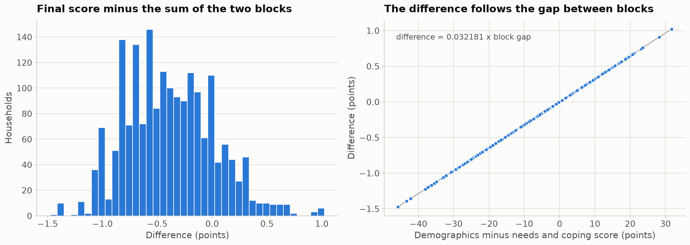

*Figure 1. Left: final score minus the sum of the two block scores, for all 1,900 households.
Right: the same difference against the gap between the two blocks. Every household lies on one
line, so the difference is arithmetic, not rounding.*

### Vulnerability index

The index never decreases as the final score rises (Spearman correlation 1.0) and lies on a
straight line: index = 2 + 0.028838 x final score, with a largest deviation of 4.5 x 10⁻⁷
([vulnerability_index_checks](tables/vulnerability_index_checks.csv)). It is the sum of the two
block geometric means described in section 3, to within 6.0 x 10⁻¹⁰. Its floor is 2.0, when
every factor is 1.0, and its ceiling is 4.88, when every factor is at its highest level; the
sample reaches 4.34.

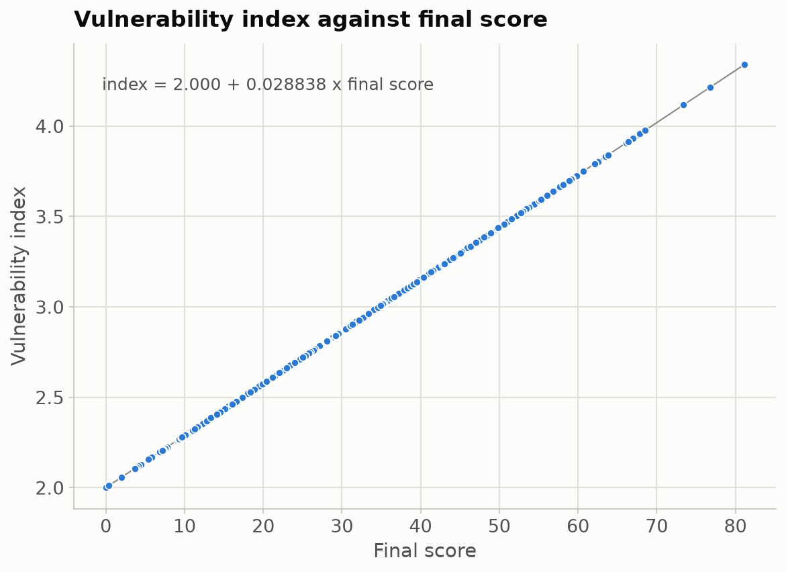

*Figure 2. Vulnerability index against final score. The points form one straight line, so the
index adds no information to the final score.*

### Category bands

The recorded categories cover these final-score ranges
([category_bands](tables/category_bands.csv)):

| Category | Households | Lowest score | Highest score |
| :--- | ---: | ---: | ---: |
| Low | 775 | 0.00 | 24.25 |
| Moderate | 394 | 24.60 | 36.96 |
| High | 612 | 31.27 | 51.69 |
| Severe | 119 | 52.21 | 81.13 |

The data place each cutpoint inside a narrow interval of the final score: Low | Moderate between
24.25 and 24.60, Moderate | High between 31.09 and 31.27, and High | Severe between 51.69 and
52.21 ([category_cutpoints](tables/category_cutpoints.csv)). Cutpoints of 2.7, 2.9 and 3.5 on the
vulnerability index, which correspond to final scores of 24.27, 31.21 and 52.01, reproduce the
recorded category for 1,890 of the 1,900 households
([category_agreement](tables/category_agreement.csv)). No threshold does better
([category_cutpoints](tables/category_cutpoints.csv)).

The 10 exceptions are all recorded Moderate with final scores between 31.33 and 36.96, a range
where every other household is High. They are the "slight overlap" mentioned in the
documentation. Six of them have the same eight factor scores as households recorded High, so no
rule that works from the factors can reproduce them
([category_mismatches](tables/category_mismatches.csv)).

Round cutpoints on the final score (24.5, 31.2 and 52.0) fall inside the same intervals and give
the same 1,890 matches, so the sample cannot tell which scale the operation bands on. The choice
would change the category of 52 of the 13,824 possible factor combinations, and of no household
in the sample ([category_cutpoint_uncertainty](tables/category_cutpoint_uncertainty.csv)).

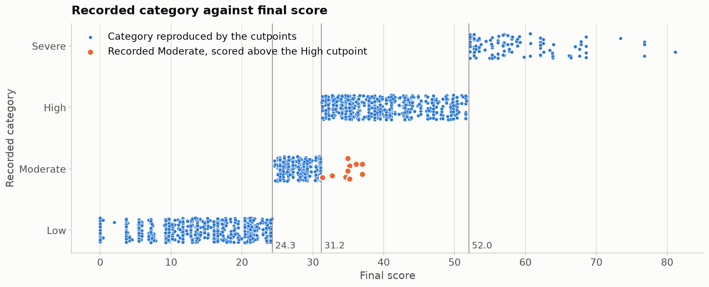

*Figure 3. Each dot is a household, placed by final score and recorded category; the vertical
lines are the cutpoints. The categories are clean bands except for 10 households recorded
Moderate with scores in the High band (orange).*

## 3. Score structure

**Key finding:** an exact formula exists. Each block score is a rescaled geometric mean of its
four factor scores and the final score combines the two blocks. The formula reproduces every
recorded score with no fitted parameters, so phase 2 can use it directly instead of a learned
model.

### The formula

Write $g_D$ for the geometric mean of the four demographic factor scores and $g_N$ for the geometric
mean of the four needs and coping factor scores. Each equals 1.0 when all its factors are 1.0.
$G_D = 2.4883$ and $G_N = 2.3955$ are their values when every factor is at its highest level
([scorecard_constants](tables/scorecard_constants.csv)).

| Score | Formula | Range |
| :--- | :--- | :--- |
| Demographics score | $50 x (g_D - 1) / (G_D - 1)$ | 0 to 50 |
| Needs and coping score | $50 x (g_N - 1) / (G_N - 1)$ | 0 to 50 |
| Vulnerability index | $g_D + g_N$ | 2.0 to 4.88 |
| Final score | $100 x (g_D + g_N - 2) / (G_D + G_N - 2)$ | 0 to 100 |

Because each block is scaled to 50 on its own, the final score weights them 1.032181 and
0.967819 ([scorecard_constants](tables/scorecard_constants.csv)); this is the "rounding" of
section 2. The final score can reach 100
([category_cutpoint_uncertainty](tables/category_cutpoint_uncertainty.csv)). The documented range
of "0 to about 81" is the highest score present in the sample, not the top of the scale.

### Evidence

The formula was compared with the candidate forms named in the brief, each fitted on all 1,900
households. The table gives the largest error in points
([score_structure_candidates](tables/score_structure_candidates.csv)):

| Form | Demographics score | Needs and coping score | Final score |
| :--- | ---: | ---: | ---: |
| Linear in the factor scores | 5.5 | 5.5 | 7.2 |
| Linear in the log factor scores | 6.9 | 4.7 | 6.8 |
| Log-linear (log score, scores above 0 only) | 21.3 | 13.0 | 50.8 |
| Multiplicative, exponents fitted freely | 6 x 10⁻⁹ | 8 x 10⁻⁹ | 6.9 |
| Lookup table of observed combinations | exact on 55 of 144 | exact on 70 of 96 | exact on 493 of 13,824 |
| Recovered formula, no fitted parameters | 4.8 x 10⁻⁹ | 9.3 x 10⁻⁹ | 1.5 x 10⁻⁵ |

The two linear forms explain 98.8% to 99.4% of the variance (R² 0.988 to 0.994) but miss
individual households by 4.7 to 7.2 points. That is enough to move a household across a category boundary: the
Moderate band is about 7 points wide, from 24.27 to 31.21
([scorecard_constants](tables/scorecard_constants.csv)). The multiplicative form, fitted with no
hint of the answer, converges to an exponent of 0.250 for every factor and to scales of 33.596
and 35.830, which is the recovered formula. It cannot fit the final score, which is a sum of two
such terms rather than one product. The lookup table is exact, but only for combinations it has
already seen, so it cannot score a household with a new combination.

The remaining errors are the precision of the file. Errors near 10⁻⁹ match the nine decimals
stored for the factor and block scores. The 1.5 x 10⁻⁵ on the final score comes from the six-decimal block weights
used to build it from the stored block scores
([final_score_vs_block_sum](tables/final_score_vs_block_sum.csv)).

The household attributes, the flags, the month and the office do not enter the score: once the
formula is applied there is nothing left for them to explain. Confidence in the formula is very
high. It has no fitted parameters, since its constants are the factor levels listed in Annex I.
It matches 493 distinct combinations to the precision of the file, and an unconstrained fit
lands on it. It cannot be checked on the 13,331 combinations that never occur in the sample.

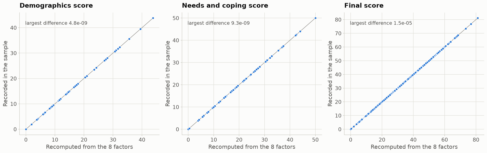

*Figure 4. Recorded scores against the scores recomputed from the eight factors with the
recovered formula. Every household lies on the diagonal; each panel gives the largest
difference.*

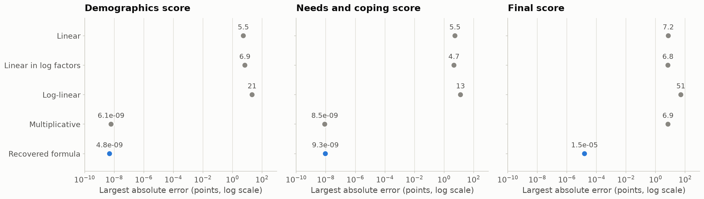

*Figure 5. Largest error of each candidate form, on a log scale. The recovered formula (blue) is
exact to the precision of the file. The multiplicative fit reaches the same precision on the two
blocks because its fitted exponents are those of the formula, but it cannot fit the final score.
The lookup table is left out because it is exact only on combinations it has seen.*

### What each factor contributes

Within a block the four factors enter symmetrically, so a factor matters through its level, not
its name. On its own, with every other factor at 1.0, the highest specific needs level (3.25)
adds 11.9 points to the final score, the highest housing level (2.82) adds 10.3 and the first
dependency step (1.04) adds 0.4 ([single_factor_effects](tables/single_factor_effects.csv)).

Because a geometric mean multiplies, factors raised together in the same block add more than the
sum of their separate effects: 3.9 points more on average (median 3.5, largest 21.2), and more
than 1 point for 75% of households ([factor_interaction](tables/factor_interaction.csv)). Between
the two blocks the effects add up exactly: where no block has two raised factors, the difference
stays below 10⁻⁵. A linear model cannot represent this, and a per-case explanation has to share
the joint effect among the factors involved.

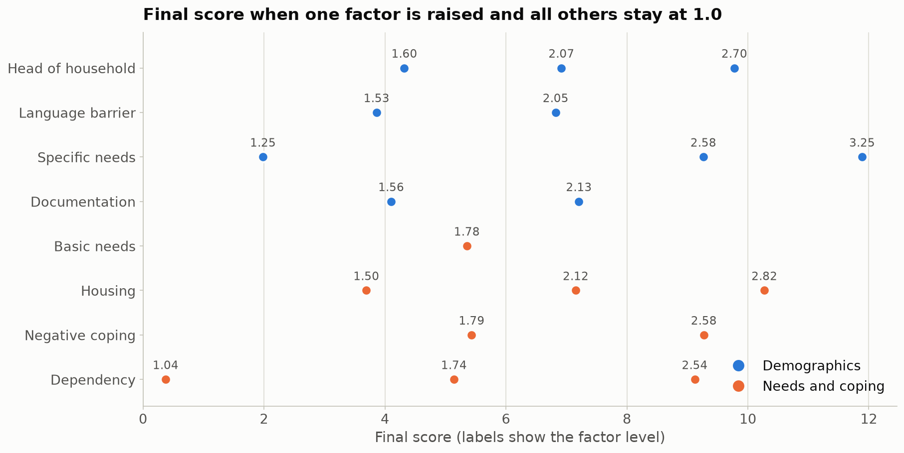

*Figure 6. Final score when a single factor is raised and every other factor stays at 1.0; labels
give the factor level. The largest single contributions come from the highest levels of
specific needs and housing.*

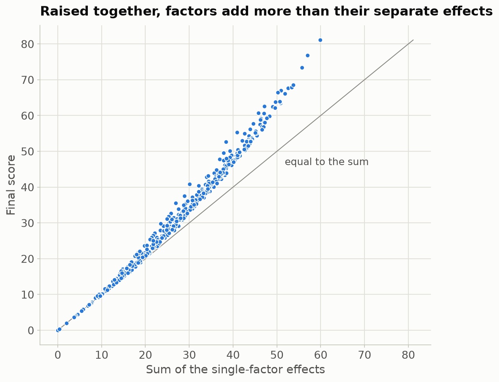

*Figure 7. Final score against the sum of the eight single-factor effects. Points above the line
are households whose raised factors reinforce each other within a block; the gap widens at
higher scores.*

### Household attributes against the factors

The household attributes carry little of the factors' information. The bias-corrected Cramér's V
between any attribute and any factor is at most 0.20
([attribute_factor_association](tables/attribute_factor_association.csv)). Speaks Spanish and the
language barrier factor are unrelated (V = 0.00): 225 of the 278 households where no adult speaks
Spanish have a language barrier score of 1.00, the lowest level
([speaks_spanish_by_language_barrier](tables/speaks_spanish_by_language_barrier.csv)). If S8 rows
are rendered as registration records for the prototype, combinations like this one will appear
and may look contradictory to a caseworker.

## 4. Univariate distributions

**Key finding:** about half the households are single people, a third have no demographic
vulnerability at all, and several factor levels are rare.

- Final score: mean 27.7, median 27.1, from 0 to 81.1; 2.6% of households score 0
  ([univariate_numeric](tables/univariate_numeric.csv)).
- The demographics score is 0 for 34.5% of households (656), because all four demographic factors
  are at 1.0. The needs and coping score is 0 for 4.8%
  ([univariate_numeric](tables/univariate_numeric.csv)).
- 48.7% of households have one member; the median household has 2 and the largest 11
  ([univariate_numeric](tables/univariate_numeric.csv)).
- Documentation is 1.00 for 96.7% of households, with 59 at 1.56 and 3 at 2.13. Other thin levels
  are head of household 1.60 (35 households), dependency 1.74 (44) and specific needs 1.25 (86)
  ([univariate_categorical](tables/univariate_categorical.csv)).
- Most flags are 0. The asylum flag is -500 for 155 households and +500 for 14; the intentions
  flag is -500 for 56 and the duplicate flag for 48
  ([univariate_categorical](tables/univariate_categorical.csv)).
- 427 households (22.5%) are included. Among the excluded, 451 are on the waiting list, 932 are
  recorded not eligible, 52 not eligible for stated intentions and 38 not eligible for duplicate
  registration ([univariate_categorical](tables/univariate_categorical.csv)).

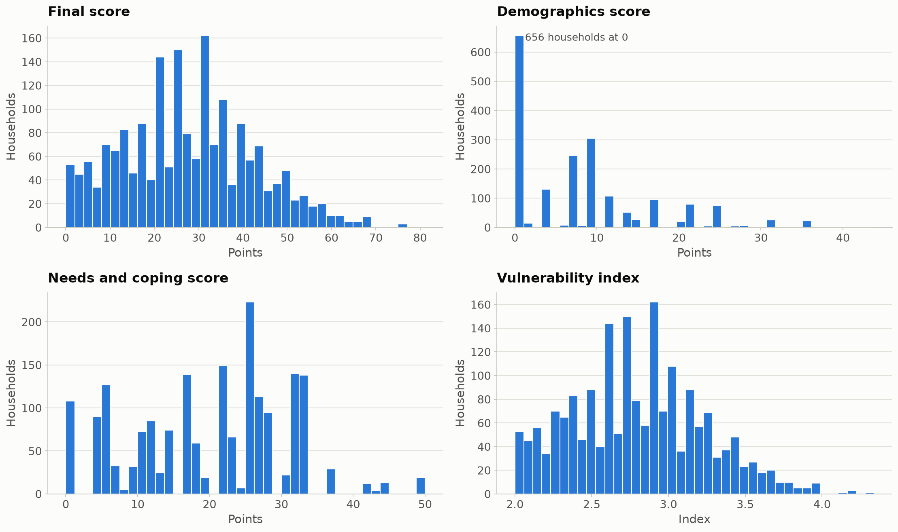

*Figure 8. Distributions of the four aggregated scores. The demographics score is 0 for a third
of households. The final score and the vulnerability index have the same shape because one is a
linear transform of the other.*

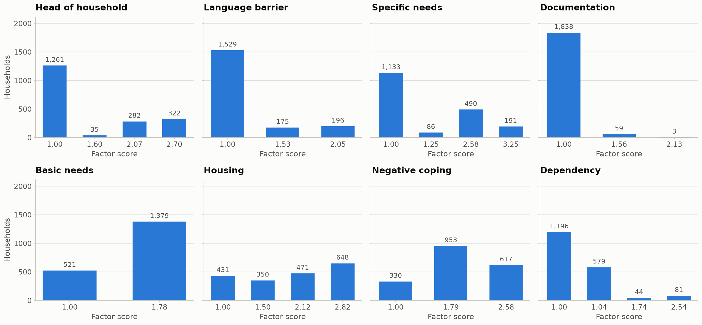

*Figure 9. Households at each level of the eight factor scores. Documentation is almost always
1.00, and several levels have fewer than 100 households.*

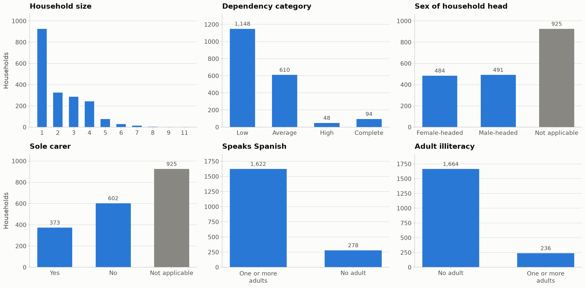

*Figure 10. Household attributes. The gray bars are single-person households, for whom sex of
household head and sole carer are not recorded.*

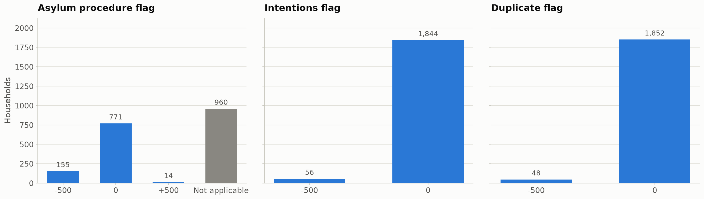

*Figure 11. Administrative flags. Most households have no flag; the gray bar is the 960
households whose asylum flag is blank.*

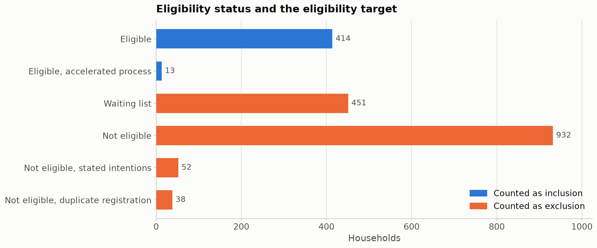

*Figure 12. Detailed eligibility status, colored by how it counts in the eligibility target. Only
the two eligible statuses count as inclusion; the waiting list counts as exclusion.*

## 5. Bivariate associations

**Key finding:** the needs and coping factors and specific needs move most with the final score.
Documentation barely does, because almost no household has a documentation problem in this
sample.

The Spearman correlations with the final score are 0.63 for housing, 0.62 for negative coping,
0.59 for basic needs, 0.56 for specific needs, 0.50 for head of household, 0.39 for dependency,
0.19 for language barrier and 0.03 for documentation (p = 0.24)
([association_with_final_score](tables/association_with_final_score.csv)). The formula weights
all factors in a block equally, so these differences come from how often and how far each factor
is raised, not from different weights.

Among the other inputs, dependency category (eta 0.41), sole carer (0.32), sex of household head
(0.31) and household size (Spearman 0.26) are moderately associated with the score. The office is
somewhat associated (eta 0.23), and the month (0.07) and the three flags (0.02 to 0.05) hardly at
all ([association_with_final_score](tables/association_with_final_score.csv)).

Among the inputs themselves, the strongest associations are between household attributes that
share the single-person "Not applicable" level: sex of head with sole carer (Cramér's V 0.81),
household size with sole carer (0.74) and household size with sex of head (0.72). Among the
factors, basic needs goes with negative coping (0.51) and with housing (0.47)
([input_association_top_pairs](tables/input_association_top_pairs.csv); Spearman correlations
between the numeric inputs are in [input_spearman_matrix](tables/input_spearman_matrix.csv)).

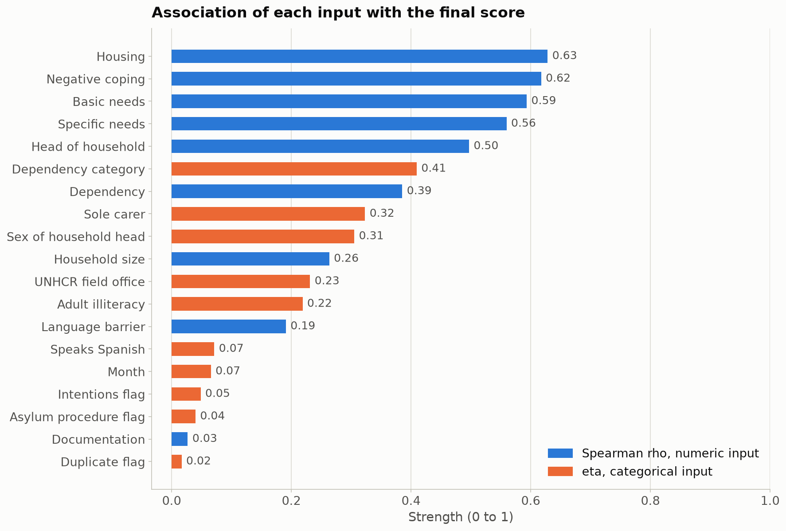

*Figure 13. Strength of the association of each input with the final score: Spearman's rho for
numeric inputs (blue) and eta for categorical inputs (orange). The factor scores lead; the flags,
the month and documentation are close to zero.*

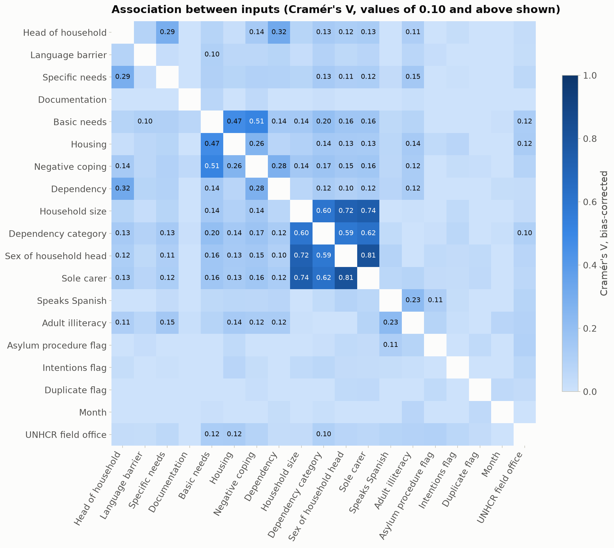

*Figure 14. Association between every pair of inputs (bias-corrected Cramér's V; all values in
[input_association_matrix](tables/input_association_matrix.csv)). The dark block among household
size, dependency category, sex of head and sole carer comes from their shared single-person
level.*

## 6. Administrative flags

**Key finding:** the flags do not enter the score, and in this sample they are unrelated to the
eligibility outcome and to the exclusion reasons they are named after.

The formula reproduces the score without the flags (section 3). The median final score by flag
level ranges from 21.5 to 31.2 ([flags_final_score](tables/flags_final_score.csv)), with eta
between 0.02 and 0.05 ([association_with_final_score](tables/association_with_final_score.csv)).

Households with at least one -500 flag are included as often as the others: 22.3% (56 of 251)
against 22.5% (371 of 1,649)
([inclusion_rate_by_negative_flag](tables/inclusion_rate_by_negative_flag.csv)). Flag by flag,
households at -500 on the asylum flag are included less often (14.8%, 95% interval 10.1% to
21.3%, against 23.6% at 0). Those at -500 on the intentions flag (32.1%, 21.4% to 45.2%) and the
duplicate flag (31.3%, 20.0% to 45.3%) are included more often
([flags_inclusion_rate](tables/flags_inclusion_rate.csv)). None of the three flags is associated
with the outcome beyond chance: chi-square p ranges from 0.09 to 0.19 and Cramér's V is at most
0.04 ([eligibility_association](tables/eligibility_association.csv)).

The flags also do not match the recorded reasons. Of the 48 households with the duplicate flag, 1
is recorded "not eligible, duplicate registration" and 15 are included; 37 of the 38 households
excluded for duplicate registration have no duplicate flag. The intentions flag shows the same
pattern: 1 of the 56 flagged households has the matching status, and 18 are included
([flags_vs_exclusion_reason](tables/flags_vs_exclusion_reason.csv),
[flags_by_eligibility_status](tables/flags_by_eligibility_status.csv)).

The documentation says the flags can override the score; the synthetic sample does not keep that
link. Review-screen material built from S8 rows will therefore show flags that contradict the
recorded decision.

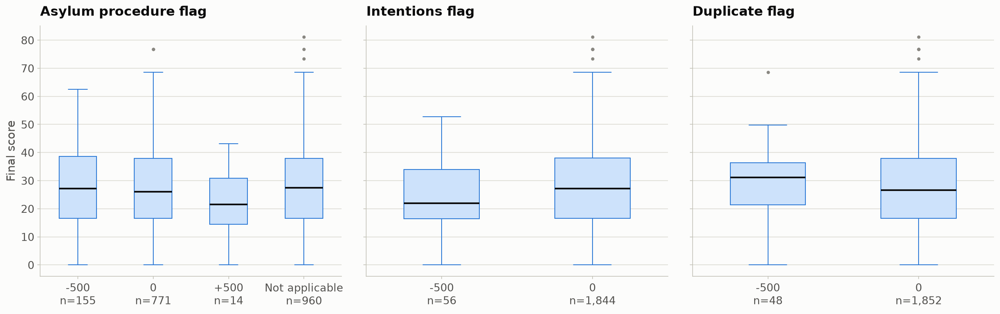

*Figure 15. Final score by flag level. The distributions overlap at every level; the +500 asylum
group has only 14 households.*

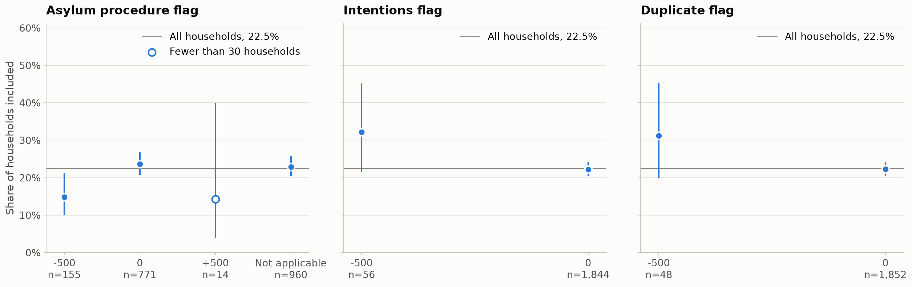

*Figure 16. Share of households included at each flag level, with 95% intervals; hollow markers
are groups under 30 households. Households flagged -500 for intentions or duplicates are not
included less often than the rest.*

## 7. Eligibility, descriptive only

**Key finding:** in this sample the inclusion decision is nearly unrelated to the score and
strongly related to the interview month, which fits the brief's description of a funding-driven
decision.

Nothing in this section is a model or a performance benchmark.

427 of the 1,900 households are included: 22.5% (95% interval 20.7% to 24.4%)
([inclusion_rate_by_group](tables/inclusion_rate_by_group.csv)). Every vulnerability category
contains both outcomes in similar proportions: 20.9% of Low, 22.3% of Moderate, 25.0% of High and
20.2% of Severe households are included. The association between category and outcome is
negligible (Cramér's V 0.02, chi-square p = 0.29)
([eligibility_association](tables/eligibility_association.csv)), and so is the association with
the final score: the median score is 29.2 for included and 26.4 for excluded households
(point-biserial r 0.03, Mann-Whitney p = 0.06)
([final_score_by_eligibility](tables/final_score_by_eligibility.csv)). The detailed statuses tell
the same story: every category has households on the waiting list and households not eligible
([eligibility_status_by_category](tables/eligibility_status_by_category.csv)).

The month matters far more. Inclusion rises from 3.6% in June 2023 to 43.6% in December 2023 and
falls to 2.7% by June 2024 (Cramér's V 0.31, p < 0.001)
([inclusion_rate_by_group](tables/inclusion_rate_by_group.csv),
[eligibility_association](tables/eligibility_association.csv)). The sample contains no funding
data, so the link to funding cannot be checked, but the pattern is what a budget that varies over
time would produce. Offices do not differ (V 0.00, p = 0.87). Their rates range from 14.3% to
25.8%, and the two smallest groups, fusal (15 households) and the blank office (21), are below 30
and unreliable.

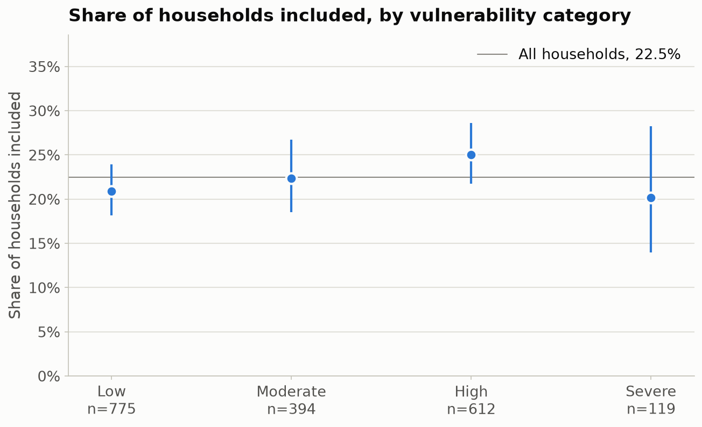

*Figure 17. Share of households included in each vulnerability category, with 95% intervals.
All four categories sit close to the 22.5% average.*

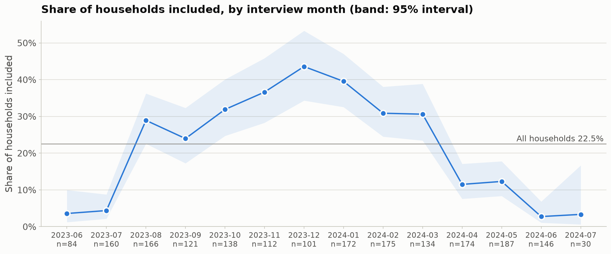

*Figure 18. Share of households included by interview month, with a 95% interval band. Inclusion
peaks at 44% in December 2023 and stays below 5% at both ends of the period.*

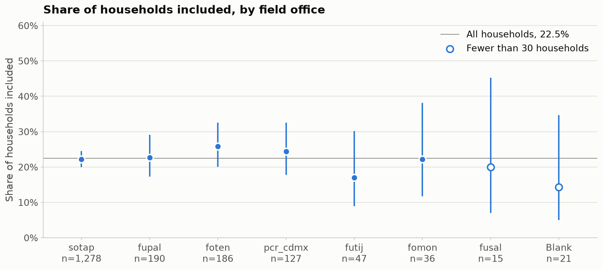

*Figure 19. Share of households included by field office, with 95% intervals; hollow markers are
groups under 30 households. No office differs clearly from the average.*

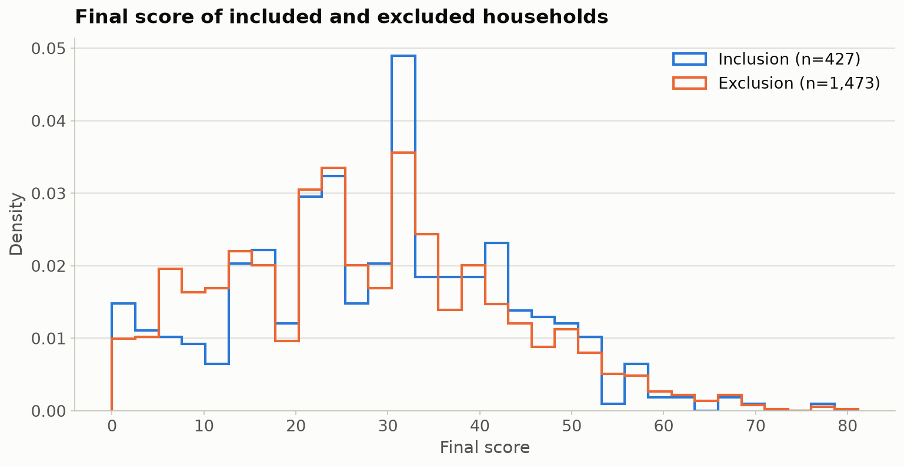

*Figure 20. Final score of included and excluded households, each scaled to the same area. The
two distributions overlap almost completely.*

## 8. Time and office

**Key finding:** the score is stable over the 14 months, but its level differs between offices,
and two thirds of the interviews come from one office.

Interviews per month range from 30 (July 2024) to 187 (May 2024); the first and last months have
the fewest (84 and 30), and no month is below 30
([interviews_by_month_and_office](tables/interviews_by_month_and_office.csv)). One office, sotap,
ran 1,278 interviews (67%); fusal (15) and the blank office (21) are below 30.

The score shows no drift. The median final score stays between 25.7 and 30.7 in every month
except July 2024 (33.2, from 30 households). Neither a Kruskal-Wallis test across months
(p = 0.97) nor the rank correlation with month order (0.01, p = 0.65) finds a change
([final_score_by_month_and_office](tables/final_score_by_month_and_office.csv),
[time_office_tests](tables/time_office_tests.csv)). The category mix is stable as well: Low makes
up between 37% and 44% of every month ([category_mix_by_month](tables/category_mix_by_month.csv)).

Offices differ. Median final scores range from 16.6 at pcr_cdmx (127 households) and 17.2 at
fomon (36) to 34.1 at foten (186), with eta 0.23 and Kruskal-Wallis p < 0.001
([final_score_by_month_and_office](tables/final_score_by_month_and_office.csv),
[time_office_tests](tables/time_office_tests.csv)). Since the score depends on the factors alone,
this reflects different mixes of households, not different scoring, and the office adds nothing
to reproducing the score. Interview counts by office and month are in
[interviews_by_office_and_month](tables/interviews_by_office_and_month.csv).

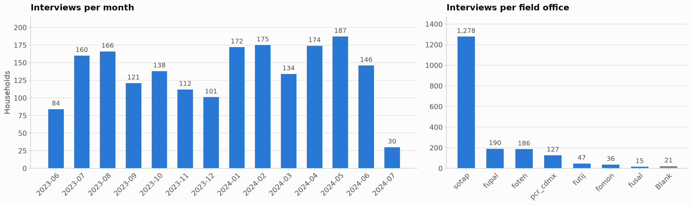

*Figure 21. Interviews per month and per field office. One office ran two thirds of the
interviews; fusal and the blank office have fewer than 30.*

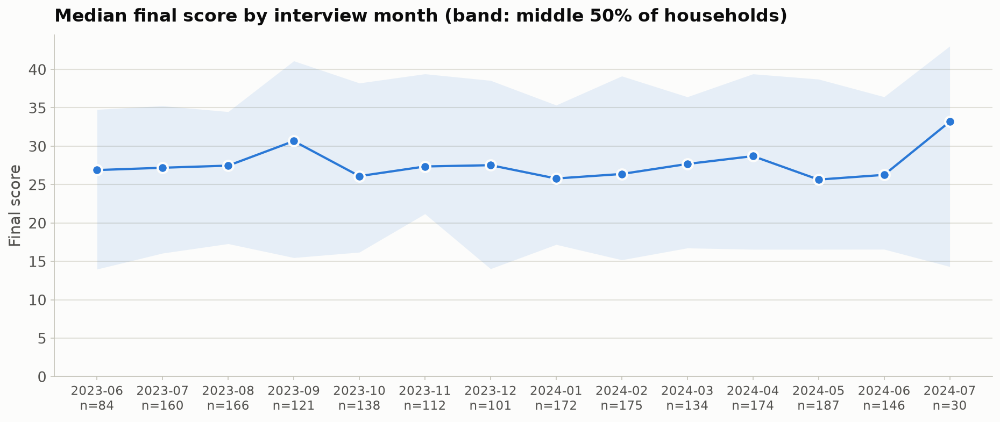

*Figure 22. Median final score by interview month, with the middle 50% of households shaded. The
level does not change over time; July 2024 has only 30 households.*

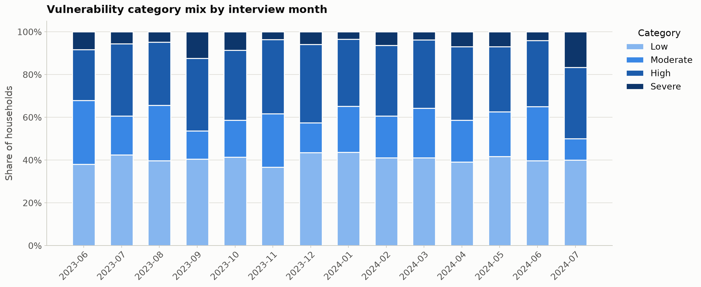

*Figure 23. Share of each vulnerability category by interview month. The mix is stable; the
larger Severe share in July 2024 comes from 30 households.*

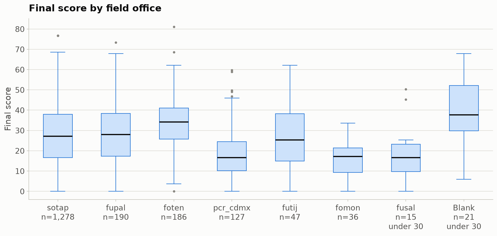

*Figure 24. Final score by field office. Medians range from 16.6 to 34.1 among offices with at
least 30 households; fusal and the blank office have fewer.*

## 9. Implications for modelling

**Key finding:** phase 2 does not need a learned model to reproduce the score. The recovered
formula is exact, uses only the eight factor scores and explains each case by construction.
Learned models are worth fitting only as a comparison.

The role of each column in phase 2 ([model_inputs](tables/model_inputs.csv)):

| Role | Columns | Reason |
| :--- | :--- | :--- |
| Inputs, feature set A | the 8 factor scores | the score is an exact function of them |
| Candidate inputs, feature set B | set A plus the 6 household attributes | not in the formula; only to show they add nothing |
| Excluded | the 3 administrative flags | not in the formula |
| Excluded | month and office | where and when an interview took place should not determine need |
| Excluded, leakage | final score, both block scores, vulnerability index, category | computed from the factor scores |
| Excluded, outcome | eligibility target and eligibility status | never model inputs |

Points that shape phase 2:

- Category: 1,890 of 1,900 households (99.5%) is the most any rule based on the score can
  reproduce in this sample, so category accuracy should be read against that ceiling
  ([category_agreement](tables/category_agreement.csv)).
- Validation: 1,658 of the 1,900 households share their factor combination with another
  household ([duplicates](tables/duplicates.csv)). A random split puts the same combinations in
  the training and the test data and flatters a learned model. Folds grouped by factor
  combination test whether a model handles combinations it has not seen.
- Explanation: the final score splits exactly into a demographics part and a needs and coping
  part. Inside each block the factors interact, so a per-factor explanation has to divide the
  joint effect. With eight factors, exact Shapley values of the formula need 256 evaluations per
  household and add up to the score.
- Rare levels such as documentation 2.13 (3 households) or head of household 1.60 (35) are where a
  learned model would be least reliable; the formula covers them by construction.

Open questions:

1. Does the operation band the category on the vulnerability index (2.7, 2.9, 3.5) or on the
   final score? The sample cannot tell. The choice changes 52 of the 13,824 possible combinations
   and no household in the sample. The released model card (S6) or Cashy code (S7) may say.
2. Should the 10 households recorded Moderate with High-band scores be treated as noise in the
   synthetic labels, or kept as cases the prototype should flag?
3. Should the prototype show the administrative flags, given that in S8 they contradict the
   recorded decisions?

## Slide-ready highlights

- The Scorecard's final score can be recomputed exactly from eight factor scores, with no fitted
  parameters: the largest error is 0.000015 points over 1,900 households.
- Each block score is a rescaled geometric mean: factors raised together in a block add on
  average 3.9 points more than their separate effects.
- The documented "rounding" gap between the final score and its two blocks is arithmetic, the
  result of scaling each block separately.
- Three cutpoints reproduce the vulnerability category for 1,890 of 1,900 households; the other
  10 cannot be reproduced by any rule based on the score.
- Inclusion is flat across vulnerability categories (20% to 25%) but swings from 3% to 44%
  between months: in this sample it follows timing, not need.
- The administrative flags neither enter the score nor match the recorded exclusion reasons.
- Household attributes are nearly unrelated to the factor scores (Cramér's V at most 0.20).

## Caveats and limitations

- All results describe the S8 synthetic sample, which keeps the Scorecard's structure and
  arithmetic but not the operation's distribution. Relations involving eligibility, flags,
  household attributes, months and offices may differ in real data.
- The formula is confirmed on the 493 factor combinations in the sample. The other 13,331
  possible combinations do not occur, so it is not tested on them directly.
- The category cutpoints are located only within intervals, and the scale they are defined on is
  unknown.
- Whether the asylum-flag blanks mean "not applicable" cannot be verified from the sample.
- Groups below 30 households are unreliable: asylum flag +500 (14 households), office fusal (15)
  and the blank office (21). July 2024 has exactly 30.
- The eligibility results are descriptive. They are not a benchmark and should not be compared
  with results reported for real data.
- Office codes are the anonymized codes in the file. Nothing in this analysis identifies an
  office, a caseworker or a household.
