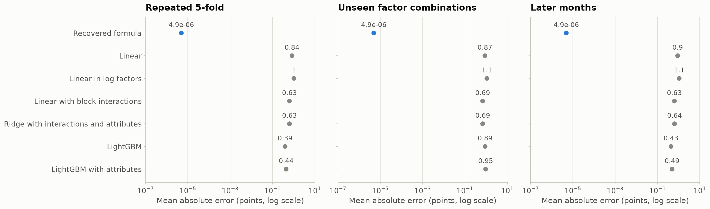
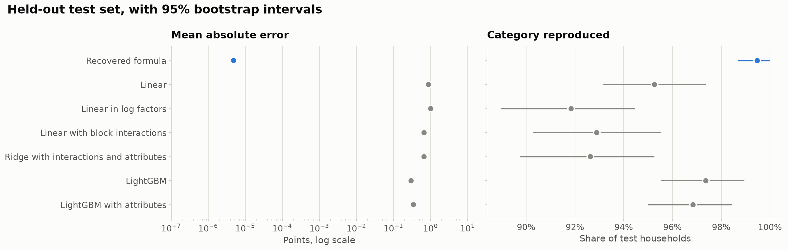
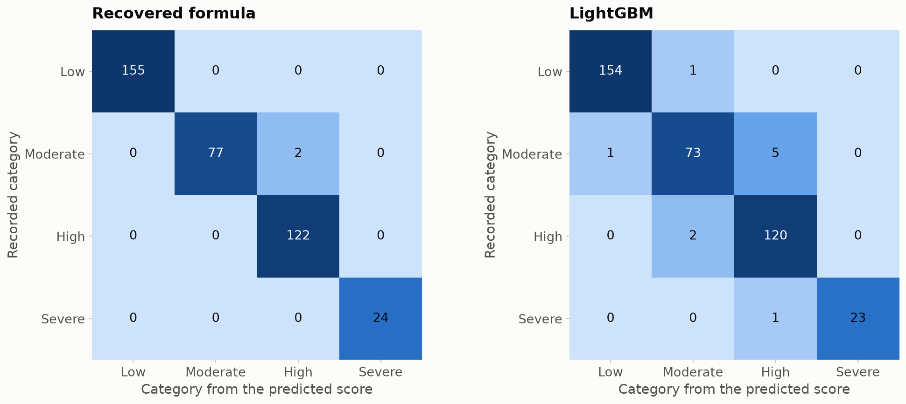
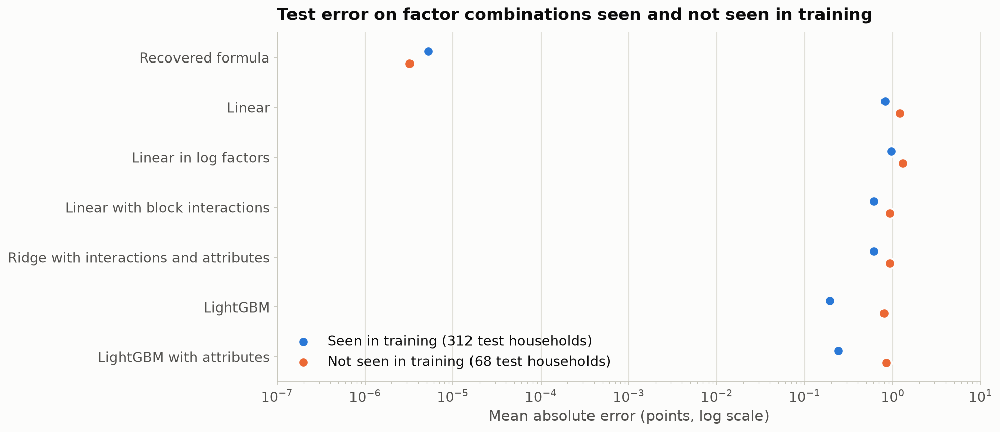
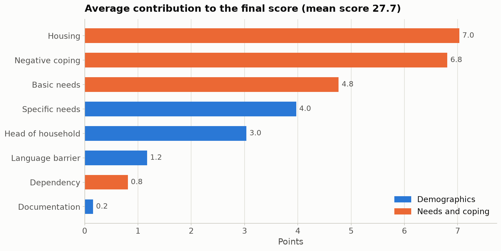
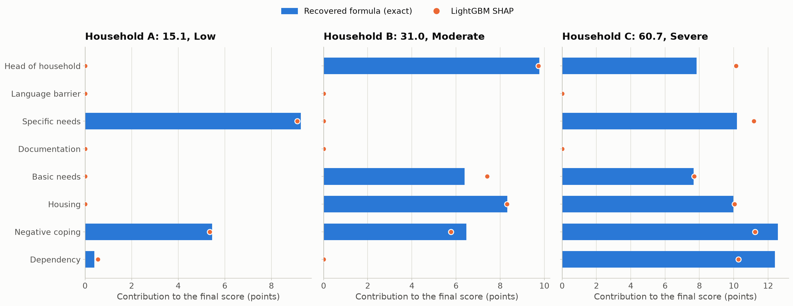

# Phase 2: score model

This report chooses and tests the model behind the "Answer" panel of the Sentinella prototype:
the model that reproduces the Scorecard final score and vulnerability category from the eight
factor scores and shows which factors produce each score. Phase 1
([01_data_exploration.md](01_data_exploration.md)) found an exact formula; this phase checks it
against learned models on data held out from every fit, and builds the per-household
explanations. The model is documented in the [model card](model_card.md).

Every number comes from [`notebooks/02_score_model.ipynb`](../notebooks/02_score_model.ipynb),
which writes its tables to [`tables/`](tables/) and figures to [`figures/`](figures/); the table
behind each number is linked next to it. All results describe the S8 synthetic sample, not the
real operation.

## 1. The chosen model

**Key finding:** the recovered Scorecard formula is the model: it reproduces the final score of
every held-out household to within 0.00002 points with no fitted parameters, and no learned
model comes close.

Seven candidates were compared, from simplest to most complex
([score_model_candidates](tables/score_model_candidates.csv)):

| Candidate | Inputs | Fitted parameters |
| :--- | :--- | ---: |
| Recovered formula | 8 factor scores | 0 |
| Linear | 8 factor scores | 9 |
| Linear in log factors | logs of the 8 factor scores | 9 |
| Linear with block interactions | 8 factor scores and the 12 products of factor pairs in the same block | 21 |
| Ridge with interactions and attributes | as above, plus the 6 household attributes | 31 |
| LightGBM | 8 factor scores | up to 6,000 leaf values |
| LightGBM with attributes | 8 factor scores and the 6 household attributes | up to 6,000 leaf values |

The selection rule, fixed before any comparison, was to take the simplest candidate whose mean
absolute error in repeated cross-validation is within 0.01 points of the best. The recovered
formula has the lowest error (0.0000049 points) and no fitted parameters, so it was selected
([score_model_cv_summary](tables/score_model_cv_summary.csv)).

A perfect fit calls for a leakage check. No candidate uses the aggregated scores, the outcomes,
the administrative flags, the month or the office
([score_model_candidates](tables/score_model_candidates.csv)). The formula is not fitted to the
final score at all: its only constants are the factor levels listed in Annex I. It is exact
because the Scorecard computes the score from these eight factors, as shown in phase 1.

## 2. Validation

**Key finding:** the formula stays exact under every check, while the learned models lose most
on factor combinations they have not seen.

Before any comparison, 380 households (20%, stratified by recorded category) were set aside as a
test set; the other 1,520 were used for everything else
([score_model_split](tables/score_model_split.csv)). On the training set each candidate was
evaluated three ways:

- repeated 5-fold cross-validation (5 repeats), for model selection;
- 5-fold cross-validation grouped by combination of the eight factor scores, so that a model is
  always tested on combinations it has not seen (5 repeats);
- a temporal check: fitted on the 1,096 interviews up to March 2024 and tested on the 424 later
  ones.

Mean absolute error in points ([score_model_cv_summary](tables/score_model_cv_summary.csv),
with every fold in [score_model_cv_folds](tables/score_model_cv_folds.csv);
[score_model_grouped_cv_summary](tables/score_model_grouped_cv_summary.csv);
[score_model_temporal](tables/score_model_temporal.csv)):

| Candidate | Repeated 5-fold | Unseen combinations | Later months |
| :--- | ---: | ---: | ---: |
| Recovered formula | 0.0000049 | 0.0000049 | 0.0000049 |
| Linear | 0.84 | 0.87 | 0.90 |
| Linear in log factors | 1.03 | 1.08 | 1.06 |
| Linear with block interactions | 0.63 | 0.69 | 0.63 |
| Ridge with interactions and attributes | 0.63 | 0.69 | 0.64 |
| LightGBM | 0.39 | 0.89 | 0.43 |
| LightGBM with attributes | 0.44 | 0.95 | 0.49 |

LightGBM is the most accurate learned model on combinations it has seen, but its error more than
doubles on combinations it has not (0.39 to 0.89 points), where the linear models change little.
No model degrades on later months. Adding the household attributes does not help any model, as
phase 1 predicted.



*Figure 1. Mean absolute error of each candidate in repeated cross-validation, on unseen factor
combinations and on later months, on a log scale. The formula's error (blue) stays below 0.00001
points under every scheme; every learned model's is above 0.3 points.*

## 3. Results on the held-out test set

**Key finding:** the best learned model explains 99.8% of the variance of the final score but
still puts 8 of 380 test households in a different category from the Scorecard, all of them near
a category boundary.

All candidates were fitted on the full training set and evaluated once on the test set; the
model had already been selected. Intervals are 95% bootstrap intervals over test households
([score_model_test_metrics](tables/score_model_test_metrics.csv)):

| Candidate | R² | Mean absolute error | Largest error | Category reproduced |
| :--- | ---: | ---: | ---: | ---: |
| Recovered formula | 1.0000 | 0.0000049 (0.0000045 to 0.0000052) | 0.000015 | 99.5% (98.7% to 100%) |
| Linear | 0.9927 | 0.88 (0.80 to 0.98) | 7.27 | 95.3% (93.2% to 97.4%) |
| Linear in log factors | 0.9916 | 1.02 (0.94 to 1.10) | 6.82 | 91.8% (88.9% to 94.5%) |
| Linear with block interactions | 0.9965 | 0.67 (0.62 to 0.73) | 3.36 | 92.9% (90.3% to 95.5%) |
| Ridge with interactions and attributes | 0.9965 | 0.67 (0.61 to 0.73) | 3.39 | 92.6% (89.7% to 95.3%) |
| LightGBM | 0.9984 | 0.30 (0.25 to 0.35) | 6.32 | 97.4% (95.5% to 98.9%) |
| LightGBM with attributes | 0.9981 | 0.35 (0.30 to 0.41) | 6.54 | 96.8% (95.0% to 98.4%) |

The formula reproduces the recorded category of 378 of the 380 test households. The other two
are recorded Moderate with scores in the High band, the label inconsistency described in phase 1;
99.5% is the most any rule based on the score can reach on this sample.

The learned models' category errors sit near the cutpoints. LightGBM puts 8 test households in a
different category from the formula, and all 8 are within 2 points of a cutpoint. Across the
six learned models, 112 of the 114 category changes are that close to a cutpoint, although only a
quarter of test households (95 of 380) are
([score_model_category_changes](tables/score_model_category_changes.csv)).

On the 68 test households whose factor combination never occurs in the training set, LightGBM's
mean absolute error is 0.80 points against 0.19 on the others, and its largest error, 6.3 points,
is on one of them ([score_model_unseen_combinations](tables/score_model_unseen_combinations.csv)).
By subgroup, LightGBM's mean absolute error ranges from 0.13 (households of 5 or more) to 0.37
(households of 3) across household sizes, and from 0.22 (Low) to 0.62 (Severe, 24 households,
under 30 and unreliable) across categories; the formula's error is below 0.0001 points in every
subgroup ([score_model_test_subgroups](tables/score_model_test_subgroups.csv)). Breakdowns by
office are in the same table; only three offices have 30 or more test households.



*Figure 2. Mean absolute error (log scale) and share of categories reproduced on the 380 test
households, with 95% bootstrap intervals. The formula is exact; the learned models reproduce
between 92% and 97% of categories.*



*Figure 3. Recorded category against the category of the predicted score, for the formula and for
LightGBM (counts in [score_model_confusion](tables/score_model_confusion.csv)). The formula's two errors are recorded Moderate households with High-band scores; all of
LightGBM's errors are between neighbouring categories.*



*Figure 4. Test error on factor combinations that do and do not occur in the training set. The
learned models, LightGBM above all, are less accurate on new combinations; the formula is not
affected.*

## 4. Explanations for the Answer panel

**Key finding:** the formula gives every household an exact breakdown of its score by factor,
which a learned model can only approximate.

Each factor's contribution is its Shapley value under the formula: its average effect on the
score over all orders in which factors are raised from 1.0, the level that adds nothing. The
eight contributions of a household add up to its final score, to within 3 x 10⁻¹⁴ points on all
1,900 households, and none is negative ([shapley_checks](tables/shapley_checks.csv)). Because the
factors of a block reinforce each other, the joint effect of two raised factors is shared between
them; the two blocks add up separately.

Across the sample, housing contributes 7.0 points on average (25% of the mean score of 27.7),
negative coping 6.8, basic needs 4.8, specific needs 4.0, head of household 3.0, language barrier
1.2, dependency 0.8 and documentation 0.2. Housing is the largest contribution for 824 households
and negative coping for 433 ([shapley_summary](tables/shapley_summary.csv)).

LightGBM's SHAP values, measured from the same reference household, approximate these
contributions. Summed over the eight factors they differ from the exact ones by 1.3 points per
test household on average, and they name a different largest factor for 6.7% of households; the
largest single difference is 4.6 points, on documentation, a factor with very few raised values
([shap_lightgbm_vs_formula](tables/shap_lightgbm_vs_formula.csv),
[shap_lightgbm_vs_formula_summary](tables/shap_lightgbm_vs_formula_summary.csv)). The
coefficients of the linear model are in [linear_coefficients](tables/linear_coefficients.csv); a
linear model credits each factor the same amount per unit whatever the other factors are, which
the Scorecard does not do.

Three test households show what the panel would display
([answer_panel_example_scores](tables/answer_panel_example_scores.csv),
[answer_panel_examples](tables/answer_panel_examples.csv)). Household B scores 30.96, Moderate,
0.25 points below the High cutpoint. LightGBM predicts 31.27 for it, which is High, and credits
basic needs with 7.4 points where the exact contribution is 6.4.



*Figure 5. Average contribution of each factor to the final score over the 1,900 households. The
four needs and coping factors (orange) account for 70% of the average score
([shapley_summary](tables/shapley_summary.csv)).*



*Figure 6. Contributions to the final score for three test households: exact values from the
formula (bars) and LightGBM's SHAP values (dots). LightGBM's values are close for most factors
but move points between factors, and its prediction puts household B in the High category.*

## 5. The predict function

**Key finding:** `predict` returns the score, the category and the eight contributions for one
household, and reproduces the recorded score of every household in the sample.

```python
from src.score_model import predict

result = predict(
    {
        "Demographics.HH.Head": 2.70,
        "Demographics.Language": 1.0,
        "Demographics.Profiles": 1.0,
        "Demographics.Documentation": 1.0,
        "Needs_and_Coping.BasicNeeds": 1.78,
        "Needs_and_Coping.Housing": 2.12,
        "Needs_and_Coping.Neg.mechanism": 1.79,
        "Needs_and_Coping.Dependency": 1.0,
    }
)
result["score"], result["category"], result["attributions"]
```

The example is household B of section 4, with its levels rounded as in Annex I; it returns
30.96, Moderate. The input is the eight factor scores under their column names in the sample;
values rounded as in Annex I are accepted, and a value that is not within 0.01 of one of the factor's levels raises
an error. The output is the final score (0 to 100), the category in English and the contribution
of each factor in points. Applied to all 1,900 households, `predict` differs from the recorded
final score by at most 0.000015 points, matches the recorded category for 1,890 of them and its
contributions always add up to the score ([predict_checks](tables/predict_checks.csv)). The unit
tests in [`tests/test_score_model.py`](../tests/test_score_model.py) check it on eight recorded
households, including the four on either side of two cutpoints, and on the lowest and highest
possible profiles.

## 6. What this means for the prototype

The Answer panel can show the Scorecard's own score, category and breakdown, exactly and without
training data, so the answer the caseworker reviews is the Scorecard itself, not an approximation
of it.
A learned model of the kind Cashy uses can fit the score almost perfectly on average and still
move households across a category boundary. In this sample those errors fall within 2 points of a
cutpoint, which suggests marking such households on the review screen as the ones most worth a
second look. This last point is a hypothesis from synthetic data, to be tested.

## Slide-ready highlights

- The score model is the Scorecard's own formula: no training, no fitted parameters, exact on
  every held-out household.
- The best learned model (LightGBM) explains 99.8% of the variance yet puts 8 of 380 test
  households in a different category, all within 2 points of a cutpoint.
- On factor combinations it has not seen, LightGBM's error more than doubles; the formula has no
  such weakness.
- Each score comes with an exact breakdown by factor that adds up to the score; housing and
  negative coping contribute most on average.
- A learned model's explanations drift from the exact ones by 1.3 points per household and name a
  different main factor for 1 household in 15.
- Household attributes, month and office add nothing to the score model.

## Caveats and limitations

- All results describe the S8 synthetic sample. The formula was recovered from it and should be
  checked against the operation's own Scorecard specification before any use beyond the
  prototype.
- The formula is confirmed on the 493 factor combinations present in the sample, not on the other
  13,331 possible ones.
- The category cutpoints are known only to within narrow intervals (phase 1); a different choice
  inside them would change the category of 52 of the 13,824 possible combinations.
- The learned models were fitted with fixed settings and no tuning. Tuning would narrow their gap
  to the formula but cannot make them exact on combinations they have not seen.
- The test set has 380 households; subgroups below 30 households, including the Severe category
  and most offices, are flagged as unreliable in the tables.
- The model reproduces the Scorecard's measure of need. It says nothing about eligibility, which
  in this sample is almost unrelated to the score (phase 1).
